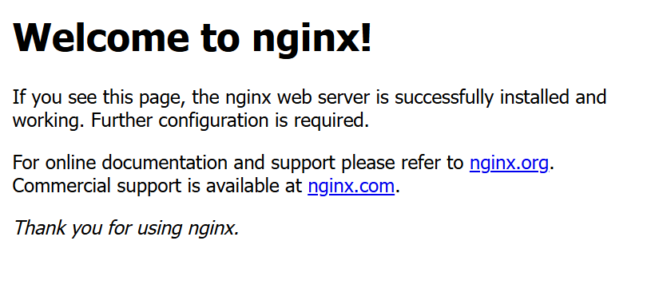

# ubuntu 安装 docker 的正确方法

由于网络原因无法通过 docker 官方的方法获取 gpg 密钥,需要用国内源

另外提一嘴,docker 的官方文档可以说写的有点烂, 点进 download 页面竟然跳出来的是 docker desktop 的安装方法

不说废话了, 感谢[这位知乎懂哥](https://zhuanlan.zhihu.com/p/588264423?utm_id=0)

```bash

## step 1
curl -fsSL https://mirrors.aliyun.com/docker-ce/linux/ubuntu/gpg | sudo gpg --dearmor -o /etc/apt/keyrings/aliyun-docker.gpg

## step 2

echo \
 "deb [arch=$(dpkg --print-architecture) signed-by=/etc/apt/keyrings/aliyun-docker.gpg] https://mirrors.aliyun.com/docker-ce/linux/ubuntu \
 $(lsb_release -cs) stable" | sudo tee /etc/apt/sources.list.d/docker.list > /dev/null

## step 3

sudo apt update
sudo apt install -y docker-ce
```

看一下好了没

```bash
docker pull nginx
docker run --name docker-nginx -p 80:80 nginx
```

经典款大鹅问候


另外有些疑问:

- 按照教程设置镜像拉取源以后速度好像没有提升,不知道是不是我搞错了
- 下面评论区的 docker 下载脚本我也没有试过,以后可以试试看
